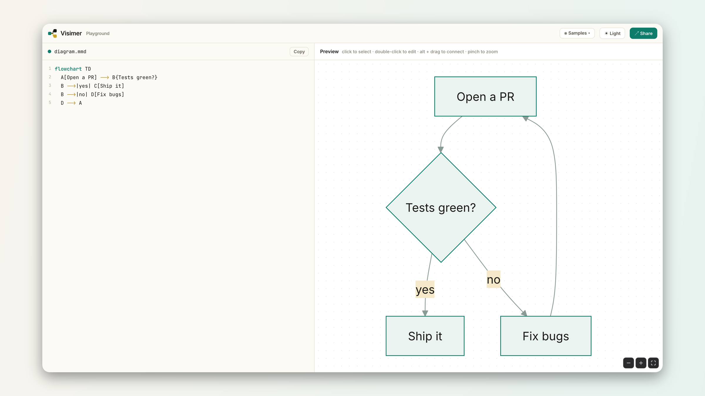
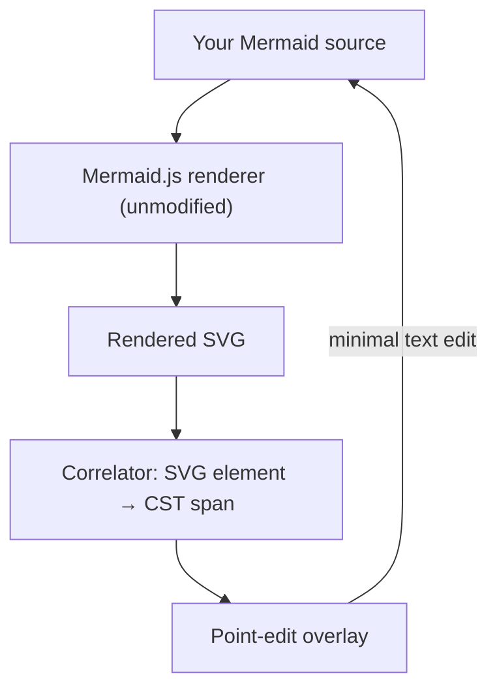

<div align="center">

# Visimer

**Visual editor for Mermaid diagrams.**

Visimer brings "what you see is what you get" editability to Mermaid diagrams. Rename labels, change shapes, add new nodes, etc. by live editing the rendered diagram.

[](./LICENSE)
[](https://mermaid.js.org)
[](#packages)



</div>

---

## Why
AI is great for generating Mermaid diagrams that help explain concepts visually. We wanted to make it easy to edit fine details visually without digging into Mermaid syntax.

## Usage

- Use as a component library that can be embedded in any application. 
- Use with a Markdown editing app like [OpenKnowledge](https://openknowledge.ai/) to edit Mermaid diagrams in your markdown.

Read the [launch post](https://openknowledge.ai/blog/edit-mermaid-diagrams-visually) for the story and a live editable diagram.

## Quick start

```bash
npm i @visimer/core @visimer/dom mermaid
```

```ts
import mermaid from 'mermaid'
import { MermaidWysiwygEditor } from '@visimer/core'
import { MermaidCanvasView } from '@visimer/dom'

const editor = new MermaidWysiwygEditor({
  code: 'flowchart TD\n  A[Start] --> B{OK?}\n  B -->|yes| C[Ship]',
})

new MermaidCanvasView({
  editor,
  container: document.querySelector('#canvas')!,
  mermaid,
  mermaidConfig: { theme: 'dark' },
})

editor.on('change', ({ code }) => console.log(code)) // always-current source
```

Try everything locally:

```bash
pnpm install && pnpm dev   # playground at http://localhost:5173
```

## Try with Open Knowledge

[OpenKnowledge](https://openknowledge.ai) is a markdown editor that allows WYSIWYG editing of markdown files. It leverages Visimer as the native visual editor for Mermaid diagrams. Available as a Mac, Linux, and Windows IDE-style app or npm package.

## What you can do

- **Edit text in place**: double-click any label and type right on the diagram; nodes grow as you type
- **Drag to connect** nodes, states, classes, entities, participants, with a ghost edge preview
- **Drag to reorder** sequence messages; the statements reorder in source
- **Popovers on every entity**: shape/type/arrow pickers, cardinalities, color swatches, fragments, notes
- **One undo stack** across canvas and code (⌘Z anywhere)
- **Error tolerant**: broken syntax mid-keystroke never blanks the canvas
- **Lossless**: unknown syntax is preserved verbatim; your diff is only what you changed

## Diagram support

**22 of 23 Mermaid diagram types are editable.**

| Type | View | Item editing | Structural editing |
|---|:---:|:---:|:---:|
| [flowchart](https://mermaid.js.org/syntax/flowchart.html) | ✅ | ✅ | ✅ |
| [sequence](https://mermaid.js.org/syntax/sequenceDiagram.html) | ✅ | ✅ | ✅ |
| [state](https://mermaid.js.org/syntax/stateDiagram.html) | ✅ | ✅ | ✅ |
| [class](https://mermaid.js.org/syntax/classDiagram.html) | ✅ | ✅ | ✅ |
| [ER](https://mermaid.js.org/syntax/entityRelationshipDiagram.html) | ✅ | ✅ | ✅ |
| [pie](https://mermaid.js.org/syntax/pie.html) | ✅ | ✅ | ✅ |
| [gantt](https://mermaid.js.org/syntax/gantt.html) | ✅ | ✅ | ✅ |
| [journey](https://mermaid.js.org/syntax/userJourney.html) | ✅ | ✅ | ❌ |
| [timeline](https://mermaid.js.org/syntax/timeline.html) | ✅ | ✅ | ❌ |
| [quadrant](https://mermaid.js.org/syntax/quadrantChart.html) | ✅ | ✅ | ❌ |
| [kanban](https://mermaid.js.org/syntax/kanban.html) | ✅ | ✅ | ❌ |
| [mindmap](https://mermaid.js.org/syntax/mindmap.html) | ✅ | ✅ | ❌ |
| [treemap](https://mermaid.js.org/syntax/treemap.html) | ✅ | ✅ | ❌ |
| [packet](https://mermaid.js.org/syntax/packet.html) | ✅ | ✅ | ❌ |
| [sankey](https://mermaid.js.org/syntax/sankey.html) | ✅ | ✅ | ❌ |
| [radar](https://mermaid.js.org/syntax/radar.html) | ✅ | ✅ | ❌ |
| [gitgraph](https://mermaid.js.org/syntax/gitgraph.html) | ✅ | ✅ | ❌ |
| [xychart](https://mermaid.js.org/syntax/xyChart.html) | ✅ | ✅ | ❌ |
| [requirement](https://mermaid.js.org/syntax/requirementDiagram.html) | ✅ | ✅ | ❌ |
| [C4](https://mermaid.js.org/syntax/c4.html) | ✅ | ✅ | ❌ |
| [architecture](https://mermaid.js.org/syntax/architecture.html) | ✅ | ✅ | ❌ |
| [block](https://mermaid.js.org/syntax/block.html) | ✅ | ✅ | ❌ |
| [zenuml](https://mermaid.js.org/syntax/zenuml.html) | ✅ | ❌ | ❌ |

**Item editing** is select, edit in place, add, and delete; **structural editing** adds connect, reorder, and restyle. Every type round-trips losslessly and syncs selection between code and canvas, including view-only zenuml (an external plugin).

## Packages

| Package | Purpose |
|---|---|
| `@visimer/core` | Headless engine: lossless CST, semantic graphs, ops → minimal text edits, unified history. Zero DOM deps |
| `@visimer/dom` | Interactive canvas: renders through your `mermaid` instance, correlates SVG ⇄ graph, all gestures |
| `@visimer/codemirror` | CodeMirror 6 pane: two-way sync, entity decorations, mermaid syntax highlighting, shared undo |
| `@visimer/monaco` | Monaco binding for an editor instance you own; zero monaco dependency of its own |
| `@visimer/react` | React bindings: `<MermaidWysiwyg code onCodeChange />` drop-in component plus `useMermaidEditor` hook |

The code-editor integration is a contract, not a dependency. `core` exposes
`bindTextPane`, a five-method adapter that gives any editor the same two-way sync;
the CodeMirror and Monaco packages are implementations of it, and neither is pulled
in unless you install it (editor libraries are peer dependencies or absent entirely).
Some other editor? Implement the adapter, it's about forty lines.

## Architecture
- Leverages the native Mermaid.js renderer for visualizing the Mermaid diagram true to how it’s intended. We just overlay/add point-edit functionality on top.
- We map the rendered SVG elements back to a Concrete Syntax Tree (CST) representation, which we can then use to edit only the parts of the Mermaid source that need updating (without affecting the rest of the file).

## Design



## License

[MIT](./LICENSE) © [Inkeep](https://inkeep.com)
